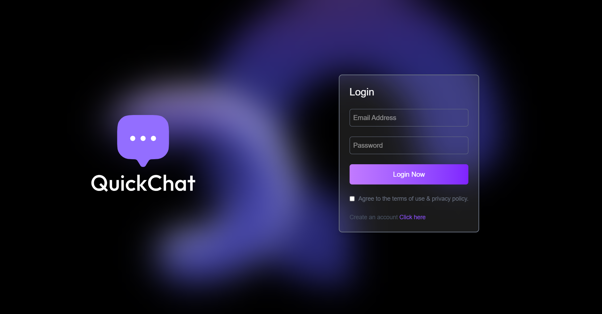
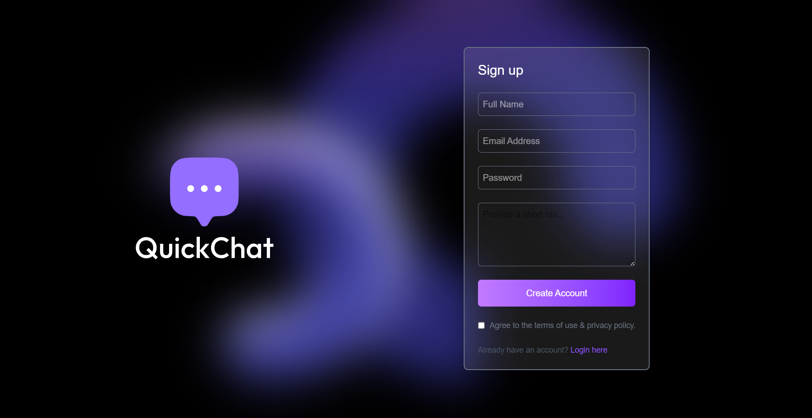
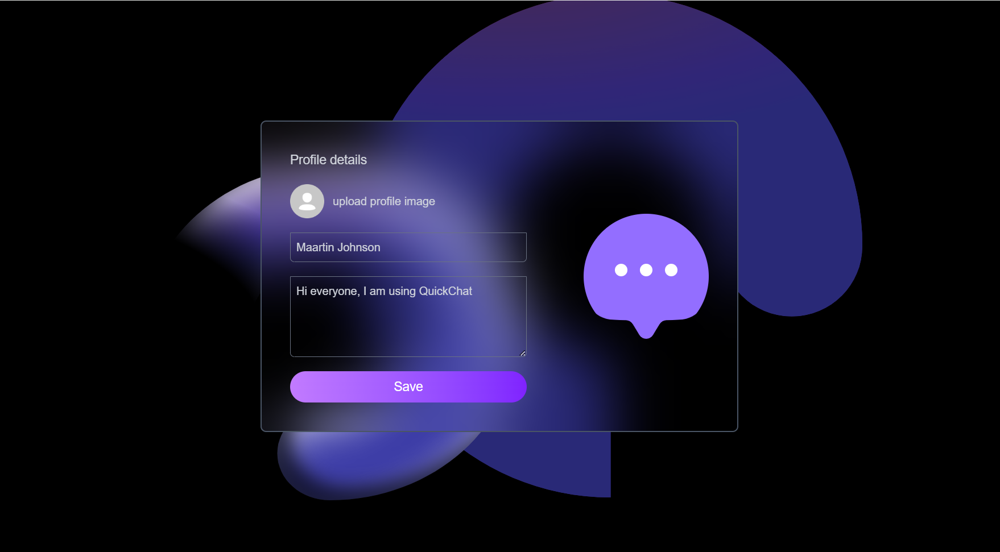
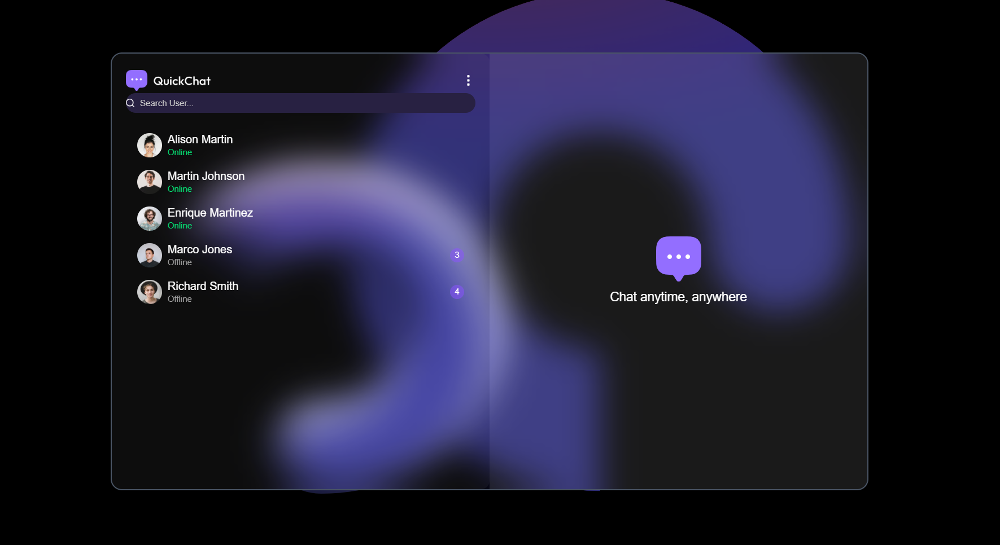
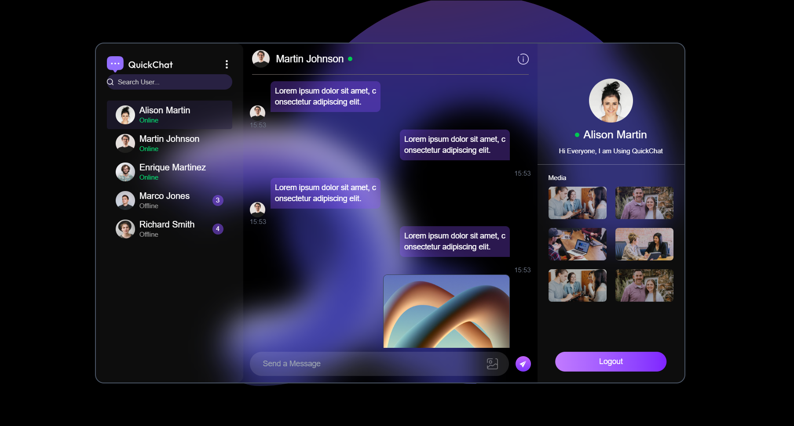

# 💬 QuickChat App

## Overview
QuickChat is a real-time chat application built with the MERN stack (MongoDB, Express, React, Node.js). It allows users to securely chat, share images, update profiles, and connect instantly in a clean and responsive interface.

---

## Features

- **🔐 Authentication**: Sign up, login, and secure access using JWT.
- **💬 Real-Time Messaging**: Instant one-on-one chats using Socket.IO.
- **📸 Image Sharing**: Send and view images in messages.
- **🧑‍💼 Profile Update**: Edit name, bio, and profile picture.
- **📱 Responsive Design**: Seamlessly adapts across devices.

---

## Technologies Used

###  Frontend:
- React.js
- Tailwind CSS
- React Router

###  Backend:
- Node.js
- Express.js
- MongoDB + Mongoose
- Socket.IO
- JSON Web Token (JWT)

---

## Installation

### 1. Clone the Repository
git clone https://github.com/yourusername/quickchat.git
cd quickchat

### 2. Setup the backend
cd backend
npm install

Create a .env file in the backend directory:
PORT=5000
MONGO_URI=your_mongodb_connection_string
JWT_SECRET=your_jwt_secret

Start the backend server:

npm run dev

### 3. Setup the frontend

cd ../frontend
npm install
npm run dev

## 📸 UI Screenshots

Below are snapshots of the QuickChat application's interface to give you a glimpse of its clean and responsive UI:

### 🔐 Login Page

---

### 📝 Signup Page

---

### 👤 Profile Page

---

### 🏠 Homepage (User List View)

---

### 💬 Chat Page (Chat Open with a User)

